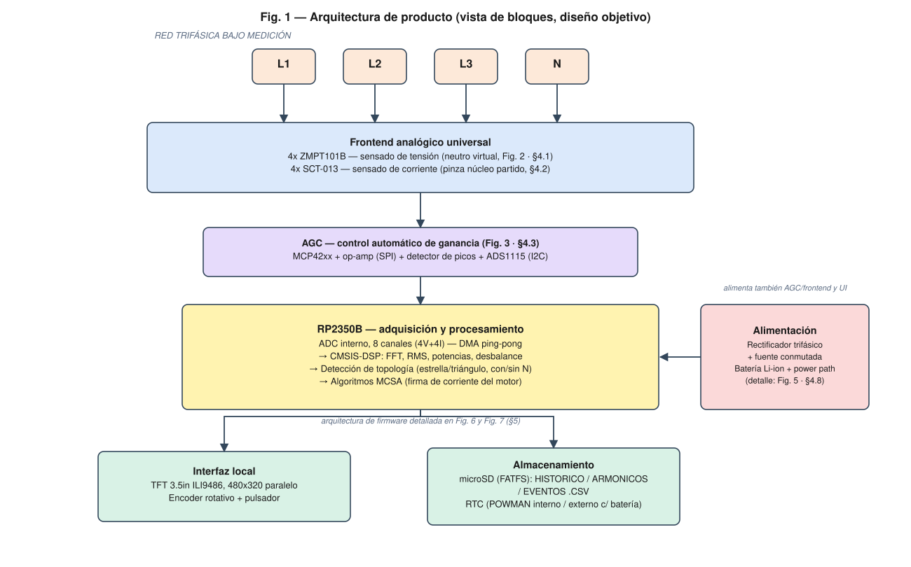
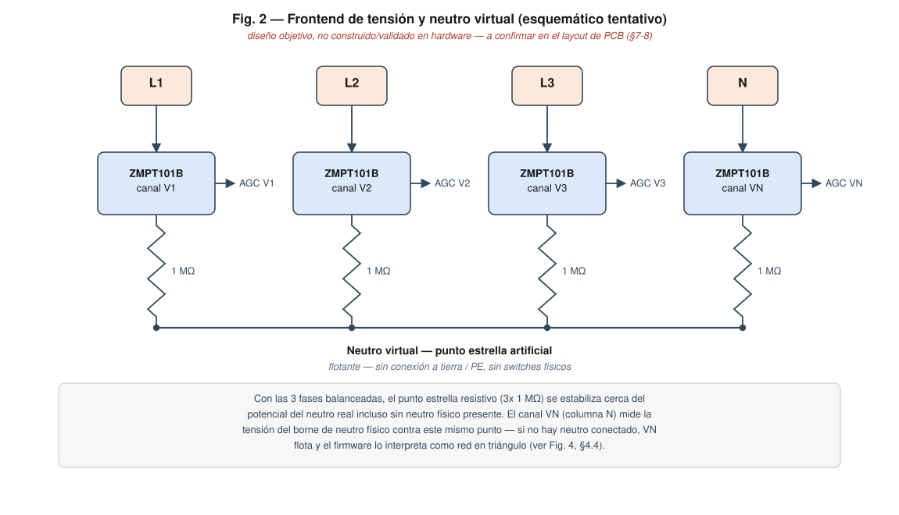
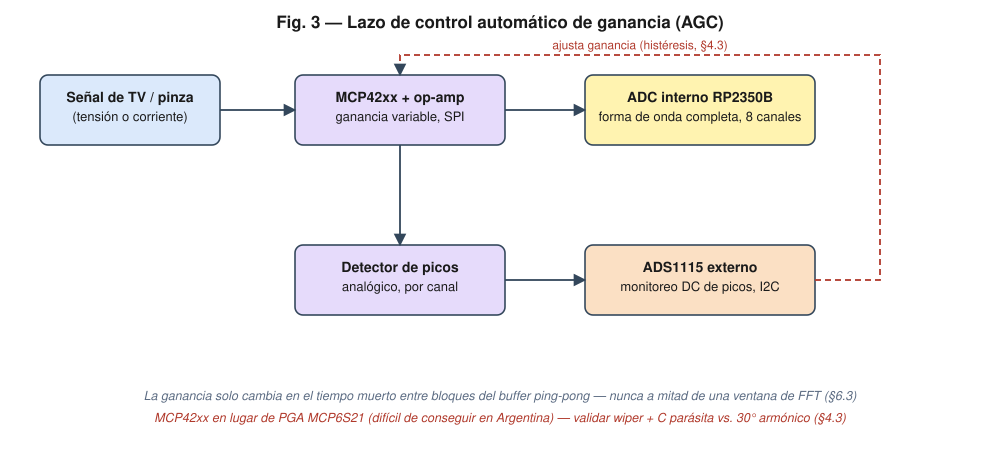
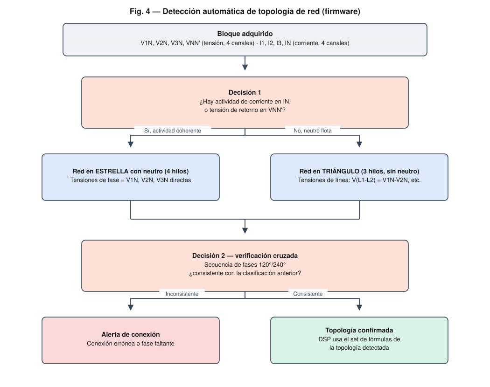
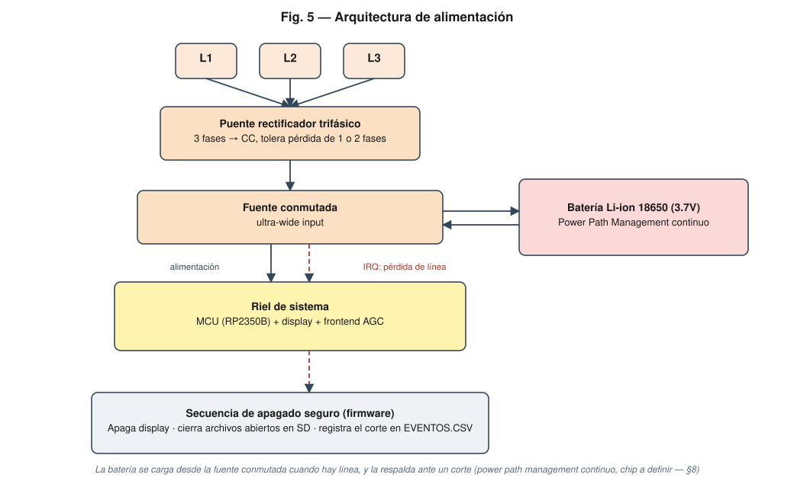
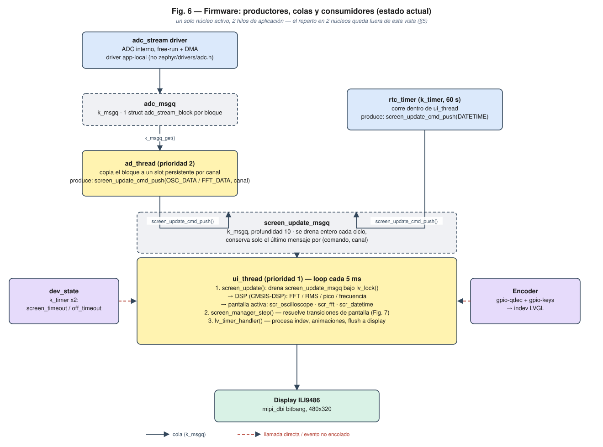
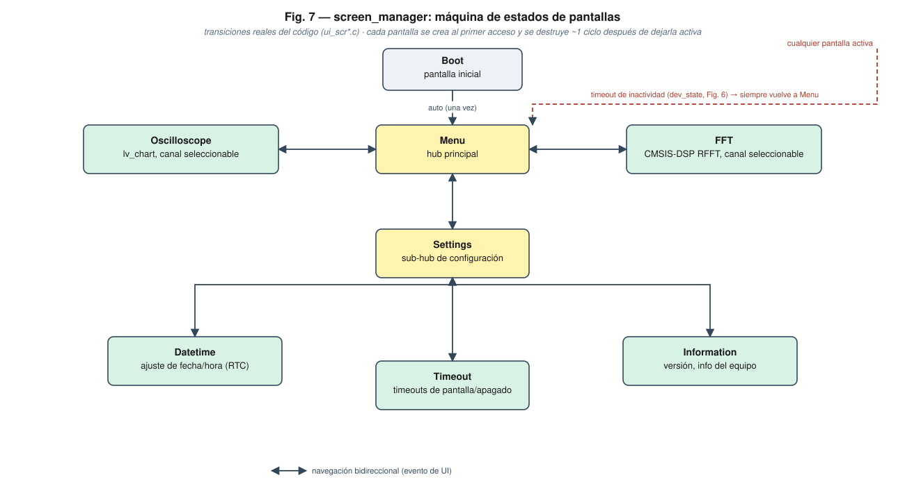

# Arquitectura del Proyecto — Analizador Trifásico de Calidad de Energía (TP Analyzer)

**Proyecto Final** — UTN FRA, Departamento de Ingeniería Electrónica, Cátedra de Proyecto Final
Autor: Fabrizio Carlassara

> Este documento es la referencia viva de arquitectura del proyecto. Se actualiza a medida que las decisiones de diseño se confirman o se revisan contra hardware real. Para el análisis de mercado completo que motiva varias de estas decisiones, ver [`estudio-mercado.md`](estudio-mercado.md).

---

## 0. Cómo leer este documento

El proyecto tiene dos capas que conviene no confundir:

- **Diseño objetivo**: la arquitectura completa del producto final — analizador trifásico fijo en riel DIN, 8 canales analógicos, AGC, batería con *power path*, registro en SD — tal como se definió a partir del estudio de mercado.
- **Estado actual de implementación**: lo que hoy existe y corre en hardware real, que es un **subconjunto de validación** del diseño objetivo (una placa de desarrollo con 1 canal de tensión + 1 de corriente, sin frontend analógico propio, sin batería gestionada, sin AGC).

Cada bloque de este documento marca explícitamente cuál de las dos capas describe. Esto es intencional: el proyecto está de-riesgando primero las piezas de mayor incertidumbre (display paralelo, ADC+DMA continuo, RTOS) sobre una placa simple antes de comprometer el diseño del hardware de adquisición final. El detalle de esa secuencia está en [`zephyr-workspace/app/ZEPHYR_MIGRATION.md`](../zephyr-workspace/app/ZEPHYR_MIGRATION.md).

---

## 1. Estudio de mercado (resumen)

El mercado de analizadores de redes trifásicos está dominado por equipos de alta gama pensados para auditorías itinerantes:

| Modelo | Rango de armónicos | Transitorios | Alimentación | Ventaja principal |
| :--- | :--- | :--- | :--- | :--- |
| Fluke 1777 | Hasta 30 kHz | Sí, hasta 8 kV (1 MS/s) | Directa desde el circuito medido | Corrección digital de errores de conexión, sin cables externos |
| Hioki PQ3198 | Hasta el orden 50º | Sí, alta precisión | Adaptador AC / batería | Cumple IEC 61000-4-30 Clase A, ideal para certificación legal |
| Megger MPQ1000 | Hasta el orden 128º | Sí, eventos de calidad de red | Adaptador AC / batería | Máxima resolución armónica en formato compacto |

Estos equipos comparten **tres barreras** frente a una PYME: precio prohibitivo, diseño de maletín pensado para uso itinerante (no instalación fija), y ecosistema de software cerrado.

### Oportunidad identificada

No se busca competir en precisión de Clase A ni en velocidad analógica. La oportunidad está en **mantenimiento predictivo accesible**: un equipo de **instalación fija en riel DIN**, junto a la maquinaria crítica, que además de calidad de energía básica corra **Análisis de la Firma de Corriente del Motor (MCSA)** — detección de fallas de rodamientos/excentricidad (modulaciones alrededor de 50 Hz ± f_vibración en la FFT de corriente) y desbalance dinámico entre fases.

Esta decisión (instalación fija vs. portátil, foco en PYME, software abierto/propio) es la que gobierna todas las decisiones de hardware y firmware descriptas en este documento — ver [`estudio-mercado.md`](estudio-mercado.md) para el análisis completo.

---

## 2. Alcance y objetivos

### 2.1 Alcance

El proyecto comprende el diseño de:

1. Hardware de adquisición trifásica universal (tensión y corriente, 3 fases + neutro), con detección automática de topología de red.
2. Frontend analógico con control automático de ganancia para aprovechar la resolución del ADC en toda la banda de armónicos de interés.
3. Gestión de alimentación autónoma desde la propia línea trifásica, con respaldo por batería.
4. Firmware sobre Zephyr RTOS que adquiere, procesa (RMS, FFT, desbalance) y presenta los datos en una interfaz local (pantalla + encoder), y los persiste para análisis posterior.
5. Un conjunto mínimo de algoritmos de mantenimiento predictivo (MCSA) sobre la firma espectral de corriente.

Explícitamente **fuera de alcance** (al menos para esta etapa): certificación Clase A (IEC 61000-4-30), conectividad remota/IoT, y una interfaz de software externa (PC/cloud) para el análisis de los CSV generados — hoy la extracción es vía tarjeta SD.

### 2.2 Objetivo general

Diseñar y validar un analizador de calidad de energía trifásico de bajo costo, de instalación fija, capaz de adaptarse automáticamente a redes en estrella o triángulo (con o sin neutro) y de generar alertas tempranas de fallas mecánicas en motores a partir del análisis de su firma de corriente.

### 2.3 Objetivos específicos

- Adquirir simultáneamente las 3 tensiones y 3 corrientes de línea (más neutro) con resolución suficiente para reconstruir armónicos hasta el orden 30 (1500/1800 Hz).
- Detectar automáticamente, sin intervención del usuario, si la conexión es estrella o triángulo y si hay neutro presente.
- Mantener la señal dentro del rango dinámico del ADC en todo momento mediante un lazo de AGC, sin introducir distorsión de fase que invalide la FFT.
- Operar de forma autónoma desde la línea trifásica, tolerando la caída de una o dos fases, con respaldo de batería para un apagado seguro.
- Registrar históricos, espectros armónicos y eventos en la tarjeta SD en un formato reutilizable (CSV) para análisis posterior.
- Validar cada subsistema de alto riesgo (display, ADC+DMA, RTOS) de forma aislada antes de integrarlos, y llevar un registro explícito del estado de cada uno (ver §7).

---

## 3. Arquitectura de producto — vista de bloques

Diagrama de bloques del **diseño objetivo** (no todos los bloques existen en hardware real todavía — ver §7):

---

## 4. Arquitectura de hardware — bloque por bloque

### 4.1 Sensado de tensión y neutro virtual

- **Componente:** 4x **ZMPT101B** (transformador de tensión aislado), uno por fase más neutro — canales V1, V2, V3 y VN.
- **Conexión al campo:** el lado "caliente" (primario) de cada ZMPT101B se conecta directamente al borne de campo correspondiente (L1, L2, L3 o N). No hay switches ni relés de reconfiguración entre el borne y el sensor — cada uno de los 4 canales está siempre conectado, mida lo que mida el usuario.
- **El punto estrella artificial ("neutro virtual"):** el lado "frío" (retorno) de los 4 ZMPT101B **no** se conecta a tierra ni a protección eléctrica (PE) — se conecta, a través de una resistencia de 1 MΩ por canal, a un único nodo común flotante. Ese nodo es el "neutro virtual": un punto de referencia sintético que el propio circuito resistivo construye, en vez de depender de que exista un neutro físico en la instalación. Ver Fig. 2.

  

- **Por qué funciona eléctricamente:** con las 3 fases balanceadas, un punto formado por 3 resistencias iguales, cada una conectada a una fase distinta, se estabiliza cerca del **centro eléctrico** del sistema trifásico — muy cerca del potencial que tendría un neutro real, incluso si la instalación es un triángulo de 3 hilos sin neutro físico. Es la misma idea que un neutro artificial resistivo o un transformador zig-zag, pero implementada con 4 resistencias pasivas en vez de un componente magnético. El canal N (VN) usa el **mismo** punto estrella como referencia: mide la tensión del borne de neutro físico *contra el neutro virtual*, no contra tierra.
- **Qué hace posible esto:**
  - **Universalidad sin hardware reconfigurable:** el mismo circuito sirve para estrella (4 hilos) y triángulo (3 hilos) sin ningún cambio físico — lo único que cambia es cómo el firmware interpreta las 4 lecturas de tensión (ver §4.4).
  - **Detección de neutro:** si hay un neutro físico conectado y activo, VN sigue de cerca al neutro virtual (la diferencia entre ambos es pequeña). Si no hay neutro físico (o está desconectado), VN queda flotando y se aparta de ese punto — es exactamente la señal que el firmware usa en el algoritmo de clasificación de topología (§4.4, Fig. 4).
  - **Por qué 1 MΩ y no un valor menor:** un valor alto minimiza la carga que el punto estrella artificial impone sobre las propias fases (no debe circular una corriente apreciable por esas resistencias, o dejaría de ser una referencia pasiva y empezaría a distorsionar la medición), y mantiene el consumo del circuito de referencia despreciable frente al de la instalación.
- **Por qué esta topología y no un selector físico:** un switch de reconfiguración estrella/triángulo agrega un punto de falla mecánico y complejidad de firmware para pilotearlo; el neutro virtual resistivo es pasivo, siempre está presente, y el firmware simplemente interpreta los datos que llegan (ver §5) en lugar de reconfigurar el hardware.
- **Estado:** diseño objetivo, esquemático tentativo — no construido ni validado contra hardware real todavía (ver §7-8). Quedan a confirmar en el diseño de PCB: el valor exacto y la tolerancia de las 4 resistencias (deben ser suficientemente parejas entre sí para que el punto estrella quede simétrico), y cómo se comporta el lado primario del ZMPT101B —dimensionado de fábrica para verse contra un neutro sólido— cuando su retorno pasa por 1 MΩ hacia una referencia flotante en lugar de una referencia de baja impedancia.

### 4.2 Sensado de corriente

- **Componente:** 4x **SCT-013** (pinza de corriente de núcleo partido), salida en tensión (0-1 V o 0-333 mV según variante), una por línea más neutro.
- **Conectores:** jack de audio 3.5 mm estéreo o conector de aviación GX12, en lugar de bornes tipo banana.
  - **Motivo de seguridad:** el secundario de un TC de núcleo partido nunca debe quedar abierto bajo carga (genera tensiones peligrosas). Un conector de 2+ contactos que solo cierra el circuito al insertarse evita ese riesgo frente a bornes expuestos.
  - **Motivo de compatibilidad:** ambos conectores son estándar y permiten usar pinzas SCT-013 económicas y ampliamente disponibles, sin adaptar cableado.

### 4.3 Acondicionamiento y control automático de ganancia (AGC)

- **Cambio de componente (revisión actual):** el diseño original elegía el PGA integrado **MCP6S21** (controlado por SPI) precisamente para evitar los problemas típicos de un potenciómetro digital usado como elemento de ganancia (ver más abajo). En la práctica, el MCP6S21 resultó difícil de conseguir en el mercado local (Argentina), así que se pivota a la familia de **reóstatos/potenciómetros digitales MCP41xx/MCP42xx** (ej. **MCP4251**, dual, SPI, ~7 bits/129 pasos) — la misma alternativa que el diseño original había descartado, ahora adoptada por disponibilidad real de componentes.
- **Implicancia de arquitectura:** a diferencia del MCP6S21 (que integra amplificador + control de ganancia en un solo IC), el MCP42xx es **solo el elemento resistivo variable** — no amplifica por sí mismo. Hace falta un **op-amp externo** armando una etapa de ganancia variable (no inversora o inversora, a definir) que use el MCP42xx como resistencia de realimentación o de división. Es un componente nuevo que el diseño con el MCP6S21 no necesitaba.
- **Qué hay que validar/tener en cuenta al usar MCP42xx en lugar de un PGA dedicado:**
  - **Capacitancia parásita:** esta familia tiene del orden de decenas de pF entre terminales (valor exacto a confirmar contra la hoja de datos del modelo final), que junto con la resistencia total del reóstato arma un polo pasabajos cuya frecuencia de corte se mueve con la posición del wiper. Hay que verificar, en el peor caso de posición, que ese polo quede muy por encima del armónico de interés más alto de este proyecto (30º, ~1500-1800 Hz) — margen que en principio sobra, porque esta limitación pega mucho más fuerte en aplicaciones de RF/audio de alta frecuencia que en la banda relativamente baja que necesita un analizador de 50/60 Hz. Igual se confirma antes de fabricar, no se asume.
  - **Resistencia del wiper:** típicamente ~75-100 Ω en esta familia, no despreciable. Hay que incorporarla explícitamente en el cálculo de ganancia (no asumir un reóstato ideal) y chequear cuánto varía con temperatura y tensión de señal frente a la exactitud de ganancia que necesita el proyecto.
  - **Linealidad de los escalones:** la relación paso→resistencia no es perfectamente uniforme (INL/DNL de fábrica). Conviene calibrar la ganancia real por escalón en firmware en vez de asumir una progresión lineal ideal.
  - **Ventaja práctica para este proyecto:** son ICs duales (2 canales de ganancia por chip) — con los 8 canales analógicos del diseño objetivo, se necesitan ~4 ICs en vez de 8 PGA individuales, sobre el mismo bus SPI que el diseño ya reservaba para esto.
  - El lazo de control (umbrales de histéresis, congelamiento por bloque) **no cambia** — sigue aplicando igual que con el MCP6S21, solo cambia qué IC recibe la orden de ganancia por SPI (§6.3).
- **ADS1115 externo (I2C)**, dedicado solo a leer las salidas DC de los detectores de pico analógicos de corriente — no compite por los canales de alta velocidad del ADC interno del RP2350B. Como la variación de pico es lenta, I2C alcanza sobradamente.
- **Soporte en Zephyr:** se revisó el árbol fuente de Zephyr **v4.4.2** (la versión fijada en `app/west.yml`, la misma que corre en este proyecto) y no existe ningún driver, *binding* de devicetree ni subsistema para la familia MCP41xx/MCP42xx (ni para las variantes I2C MCP45xx/46xx). Microchip tiene soporte nativo amplio en Zephyr para otras familias propias — GPIO expanders (`mcp23xxx`), controladores CAN (`mcp2515`, `mcp251xfd`), ADCs (`mcp320x`, `mcp356x`), DACs (`mcp4725`, `mcp4728`), RTC (`mcp7940n`) — pero **no para los potenciómetros/reóstatos digitales**; Zephyr tampoco tiene una clase de driver genérica para "resistencia variable" (no hay equivalente al subsistema `adc`/`dac`/`sensor` para esto).
  - **Decisión:** driver app-local propio, con su *binding* de devicetree y una API mínima (ej. `mcp4xxx_set_wiper(dev, canal, valor)`), siguiendo el mismo patrón que `drivers/adc_stream/` y `drivers/powman_rtc/` — mantiene la consistencia del proyecto (dispositivo en devicetree, `DEVICE_DT_GET`, `Kconfig` propio) en vez de llamar a la API de SPI directamente desde el módulo de AGC. Se descarta la alternativa de escrituras SPI sueltas sin driver: aunque el protocolo del MCP41xx/42xx es simple (un byte de comando + un byte de dato por escritura de wiper), mantener un solo patrón de integración de periféricos en todo el proyecto vale más que ahorrarse el *boilerplate* de un driver mínimo.
  - **Implementación:** pendiente — se escribe una vez que exista el frontend de 8 canales para probarlo contra hardware real (ver §8).
- **Lógica de histéresis en firmware** (para evitar *chattering*):
  - Saturación (> 3,0 V): reduce un escalón de ganancia para la siguiente captura.
  - Baja resolución (< 1,0 V): incrementa un escalón de ganancia.
  - **Congelamiento por bloque:** la ganancia solo cambia en el tiempo muerto entre ráfagas del buffer circular, para que cada bloque de N muestras analizado por CMSIS-DSP tenga ganancia estrictamente constante durante toda la ventana de FFT.

### 4.4 Detección automática de topología de red (estrella / triángulo, con / sin neutro)

Esta es una característica transversal hardware + firmware:

**Hardware** — el neutro virtual resistivo (§4.1, Fig. 2) garantiza que los 4 canales de tensión (V1N, V2N, V3N, VNN′) siempre entreguen una lectura válida, exista o no un neutro físico conectado. Los 4 canales de corriente (I1, I2, I3, IN) hacen lo mismo para corriente.

**Firmware** — algoritmo de clasificación, evaluado periódicamente sobre cada bloque adquirido:

- El desfasaje entre fases (secuencia 120°/240°, obtenida por cruces por cero o por fase de la componente fundamental de la FFT) se usa como verificación cruzada, no solo para clasificar sino para detectar conexiones erróneas o fases faltantes.
- El resultado de esta clasificación determina qué set de fórmulas usa el resto del pipeline DSP (potencias, THD, desbalance) — no requiere ninguna reconfiguración de hardware ni intervención del usuario.
- **Estado actual:** diseño definido, no implementado — el firmware actual adquiere un solo canal de tensión y uno de corriente (ver §7), no hay todavía lógica de clasificación de topología corriendo. Es el próximo hito natural una vez el frontend de 8 canales exista en hardware.

### 4.5 Microcontrolador

- **RP2350B** (QFN-80), doble núcleo Cortex-M33, en el módulo **Core2350B0** (Waveshare, SoM).
- Se eligió un SoM en lugar de RP2350B "pelado" para reducir el diseño de la placa objetivo a la circuitería específica del analizador (frontend, AGC, alimentación), delegando la parte crítica de alta velocidad (USB, cristal, regulación local del SoC) al módulo.
- 8 canales ADC internos disponibles, usados en el diseño objetivo como 4 de tensión + 4 de corriente, cada uno con DMA en modo *ping-pong* para adquisición continua sin intervención de CPU entre bloques.

### 4.6 Interfaz de usuario

- **Display:** TFT 3.5" ILI9486, 480×320, interfaz paralela 8080 de 8 bits (shield con microSD integrada por SPI).
- **Entrada:** encoder rotativo con pulsador integrado (cuadratura A/B + click).
- Elegido sobre touch/capacitivo por robustez en entorno industrial (polvo, guantes, vibración de tablero) y simplicidad de driver.

### 4.7 Almacenamiento y timestamping

- **microSD** vía SPI, sistema de archivos FATFS, con tres archivos CSV (ver §6.4):
  - `HISTORICO.CSV`: promedios cada 10-15 min (RMS V/I, potencias, THD).
  - `ARMONICOS.CSV`: amplitudes de armónicos 1 a 30 por fase (firma espectral).
  - `EVENTOS.CSV`: bitácora de eventos con marca de tiempo (desbalances críticos, caídas de tensión, cortes de línea).
- **RTC:** el diseño objetivo contempla un RTC externo (ej. DS3231) para que el timestamping sobreviva cortes de alimentación con precisión, respaldado por la misma batería del equipo. Ver §7 sobre qué RTC corre hoy en el prototipo.

### 4.8 Alimentación

- **Toma de línea:** un puente rectificador trifásico alimenta una fuente conmutada de entrada ultra-ancha, de forma que el equipo se autoalimenta desde la propia red bajo medición y tolera la pérdida de una o dos fases sin perder alimentación.
- **Batería de respaldo:** celda Li-ion 18650 con gestión de *power path* continuo (la batería no se desconecta para cargar; alimenta la carga si la línea cae, y se recarga cuando vuelve). Ante un corte, un pin de interrupción avisa al firmware para secuenciar un apagado seguro: apagar pantalla, cerrar archivos abiertos en SD, y dejar registro del corte en `EVENTOS.CSV`.
- **Decisión pendiente:** el chip específico de *power path management* (candidatos típicos: familias TI BQ25xxx / MCP73871 con *power path*) todavía no está seleccionado — ver §8 (trabajo futuro / decisiones abiertas).

---

## 5. Arquitectura de firmware (Zephyr RTOS)

El firmware que corre hoy (sobre el devboard, no sobre el hardware de adquisición final) es un **subconjunto validado en un solo núcleo**, construido incrementalmente según el plan de [`ZEPHYR_MIGRATION.md`](../zephyr-workspace/app/ZEPHYR_MIGRATION.md). Esta sección lo describe tal como existe en el código hoy, desde el punto de vista de **productores, colas y consumidores** — qué módulo genera datos, por dónde pasan, y quién los consume. El estudio de mercado plantea repartir esta carga entre los dos núcleos del RP2350B (ver [`estudio-mercado.md`](estudio-mercado.md), §5); esa decisión de particionado en núcleos queda deliberadamente fuera de esta versión del documento — se retoma más adelante (§8) una vez que haya datos reales de carga con más de 2 canales activos.

### 5.1 Productores, colas y consumidores

- **`adc_stream driver → adc_msgq → ad_thread`**: el driver deja un bloque (`struct adc_stream_block`) por canal en `adc_msgq` cada vez que el DMA completa una mitad del buffer ping-pong. `ad_thread` (prioridad 2) lo copia a un slot persistente propio por canal — necesario porque el puntero del bloque solo es válido hasta que llegue el siguiente para ese mismo canal — y a partir de ahí actúa como **productor** hacia la siguiente cola.
- **`ad_thread` / `rtc_timer` → `screen_update_msgq` → `ui_thread`**: `screen_update_msgq` es el punto de encuentro de todos los productores de UI. `ad_thread` empuja `OSC_DATA`/`FFT_DATA` (con el canal como parte de la clave), y `rtc_timer` —un `k_timer` que vive dentro de `ui_thread` y dispara cada 60 s— empuja `DATETIME`. `ui_thread` (prioridad 1) la drena entera en cada vuelta de su loop (~5 ms) y se queda **solo con el último mensaje por (comando, canal)** — así una pantalla que se atrasó un ciclo no arrastra frames viejos de osciloscopio o FFT.
- **Llamadas directas, sin cola**: no todo pasa por `screen_update_msgq`. `dev_state` (dos `k_timer` para timeout de pantalla y de apagado) invoca `screen_manager_go_to()` directamente desde el callback de expiración cuando el usuario deja de interactuar. El encoder (`gpio-qdec` + `gpio-keys`, drivers nativos de Zephyr) entrega sus eventos al *indev* de LVGL, que `lv_timer_handler()` consume como parte de su propio ciclo. Ambos caminos están marcados en rojo punteado en la Fig. 6 para distinguirlos de las colas.
- **Dentro de `ui_thread`**, cada vuelta del loop hace, en orden: 1) drenar `screen_update_msgq` y despachar los handlers correspondientes bajo `lv_lock()` (que a su vez llaman a CMSIS-DSP para FFT/RMS/pico/frecuencia y actualizan la pantalla activa); 2) `screen_manager_step()`, que resuelve transiciones de pantalla pendientes (ver Fig. 7, §5.2); 3) `lv_timer_handler()`, que procesa el *indev* del encoder, corre animaciones y hace *flush* de las regiones sucias al display.
- **Por qué una cola propia y no `lv_async_call`**: se evaluó usar el mecanismo nativo de LVGL/Zephyr (`CONFIG_LV_Z_RUN_LVGL_ON_WORKQUEUE` + `lv_async_call`) en vez de `screen_update_msgq`, pero se descartó — `lv_async_call` encola cada llamada como un timer LVGL independiente y las ejecuta todas, mientras que el comportamiento que este proyecto necesita (descartar frames de osciloscopio/FFT viejos y quedarse solo con el más reciente por canal) no tiene equivalente directo sin reimplementar a mano la misma lógica de *coalescing* vía `lv_async_call_cancel()`.
- **El puntero de `adc_stream_block` no copia las muestras**: apunta al buffer interno del driver y es válido solo hasta que llegue el próximo bloque de ese canal. Por eso `ad_thread` lo copia a un slot propio antes de reenviarlo — para que ese puntero no se invalide mientras la UI todavía lo está leyendo.
- **Parámetros de adquisición actuales** (Kconfig, `app/Kconfig` + `drivers/adc_stream/Kconfig`):

  | Parámetro | Valor actual |
  | :--- | :--- |
  | Muestras por canal por bloque (`ADC_STREAM_PER_CHANNEL_BUFFER_SIZE`) | 1024 |
  | Frecuencia de muestreo por canal (`ADC_STREAM_PER_CHANNEL_SAMPLE_RATE_HZ`) | 10 240 Hz |
  | Bins de FFT (`FFT_BINS`) | 512 |
  | Prioridad `ad_thread` / stack | 2 / 2048 B |
  | Prioridad `ui_thread` / stack | 1 / 8192 B |

Puntos clave del estado actual frente al diseño objetivo (todos verificables contra el código en `zephyr-workspace/app/`):

- **Un solo canal de tensión y uno de corriente** (`voltage_a`, `current_a` en el overlay de devicetree), no los 8 del diseño objetivo — el driver `adc_stream` ya está escrito para escalar a `ADC_STREAM_MAX_CHANNELS` canales (deriva ese número de los nodos hijos habilitados en devicetree), así que agregar canales es principalmente trabajo de devicetree + hardware, no de reescribir el driver.
- **Un solo núcleo activo, dos hilos** (`ad_thread` prioridad 2, `ui_thread` prioridad 1 — en Zephyr, número menor es más prioritario), no el esquema de dos núcleos + hilo AGC dedicado del diseño objetivo (§8).
- **Sin AGC**: no hay MCP42xx/op-amp ni ADS1115 en el devboard actual; los canales ADC son entradas directas sin acondicionamiento propio del proyecto.
- **Sin persistencia en SD**: FATFS no está habilitado en `prj.conf` todavía; los CSV descriptos en §4.7/§6.4 son parte del diseño objetivo, no algo que el firmware escriba hoy.
- **RTC interno (POWMAN)**, no el RTC externo con respaldo de batería (DS3231) del diseño objetivo — ver `drivers/powman_rtc/`.
- **Encoder e input**: no requirió driver propio — se resolvió enteramente con drivers nativos de Zephyr (`gpio-qdec`, `gpio-keys`, `zephyr,lvgl-encoder-input`), a diferencia de casi todo lo demás en este proyecto.

### 5.2 Máquina de estados de pantallas

`screen_manager` gobierna qué pantalla LVGL está activa y cómo se transiciona entre ellas. Es un consumidor de la cola `screen_update_msgq` (recibe `DATETIME` para refrescar el reloj de la barra superior) y, a la vez, el destino de las llamadas directas de `dev_state` y de los eventos de navegación que generan las propias pantallas (botones tocados con el encoder).

- **Ciclo de vida perezoso**: cada pantalla se registra con 6 callbacks (`create`/`destroy` generados por SquareLine Studio, más `prepare`/`init`/`deinit`/`step` a nivel de aplicación). Solo la pantalla activa —y, brevemente, la que se acaba de abandonar— existen en el heap de LVGL a la vez: una pantalla se construye (`create` + `prepare`) recién en su primer acceso, y se destruye unos `CONFIG_SCREEN_DESTROY_DELAY_MS` después de dejar de estar activa (para no cortar una animación de transición en curso). Esto mantiene bajo el uso de RAM del heap de LVGL sin necesidad de tener las 8 pantallas construidas de antemano.
- **Topología real de navegación** (extraída de los `_ui_screen_change()` en `ui_scr*.c`, no es un diseño aspiracional): `Menu` es el *hub* principal, con navegación bidireccional a `Oscilloscope`, `FFT` y `Settings`. `Settings` es a su vez un *sub-hub* con navegación bidireccional a `Datetime`, `Timeout` e `Information`. `Boot` transiciona a `Menu` una única vez, al arrancar.
- **Mecanismo de respaldo global**: si `dev_state` detecta inactividad (sin giro de encoder ni click) por más que `screen_timeout_ms`, llama a `screen_manager_go_to(SCREEN_MENU)` sin importar en qué pantalla esté el usuario — así el equipo nunca queda "perdido" en una pantalla de configuración por olvido del operador.
- **Resolución de transición** (`screen_manager_step()`, llamado en cada vuelta del loop de `ui_thread`): si hay una transición pendiente, ejecuta `deinit()` de la pantalla saliente, construye la entrante si es la primera vez que se visita, la carga, ejecuta `prepare()` (una sola vez por construcción) e `init()`, actualiza el reloj de la barra superior contra el RTC, y programa la destrucción diferida de la pantalla saliente.

### 5.3 Por qué un driver ADC propio

El driver estándar `raspberrypi,pico-adc` de Zephyr es por interrupción, muestra por muestra, sin ruta de DMA. El proyecto necesita adquisición continua en *free-run* hacia un buffer ping-pong, así que se escribió `drivers/adc_stream/` como driver app-local: usa el HAL de Pico-SDK para el lado ADC (free-run + FIFO, que el subsistema ADC de Zephyr no modela) y el API estándar `zephyr/drivers/dma.h` para el lado DMA (mismo patrón que `adc_stm32.c` usa contra un controlador DMA real). No sigue el contrato genérico `zephyr/drivers/adc.h` ni la API más nueva `CONFIG_ADC_STREAM`/RTIO — con un solo consumidor en la aplicación, ese contrato genérico agrega complejidad sin necesidad; queda documentado como algo a revisar solo si el driver necesitara ser reusable/subible a upstream.

---

## 6. Alcance de los algoritmos de procesamiento

### 6.1 Ya implementado

- FFT real (RFFT) vía CMSIS-DSP sobre bloques de 1024 muestras → 512 bins, con ventana Hanning (`CONFIG_CMSIS_DSP_WINDOW`).
- Cálculo de bins de frecuencia (`dsp_get_frequency_bins`) parametrizado por `fs`/`N`, ya listo para reutilizarse con cualquier frecuencia de muestreo final.

### 6.2 Diseño objetivo, no implementado todavía

- Cálculo de RMS de tensión/corriente por fase, potencias (activa/reactiva/aparente) y THD.
- Clasificación de topología de red (§4.4).
- Desbalance dinámico entre fases.
- MCSA: detección de modulaciones en banda lateral (50 Hz ± f_vibración) asociadas a fallas de rodamientos/excentricidad.

### 6.3 Nota de diseño — AGC y ventanas de FFT

El congelamiento de ganancia "por bloque" (§4.3) es un requisito directo de cómo funciona hoy la FFT: como CMSIS-DSP analiza bloques completos de N muestras, cualquier cambio de ganancia a mitad de bloque introduciría un escalón de amplitud dentro de la misma ventana temporal, contaminando todos los bins de armónicos. El AGC target debe sincronizarse con los límites de bloque del `adc_stream` driver (el mismo mecanismo de ping-pong que ya existe), no con un timer independiente.

### 6.4 Formato de datos en SD (diseño objetivo)

| Archivo | Contenido | Cadencia |
| :--- | :--- | :--- |
| `HISTORICO.CSV` | RMS V/I, potencias, THD (promedios) | Cada 10-15 min |
| `ARMONICOS.CSV` | Amplitud de armónicos 1-30 por fase | Por ventana de FFT (o muestreada) |
| `EVENTOS.CSV` | Alertas de desbalance, caídas de tensión, cortes de línea, con timestamp RTC | Por evento |

---

## 7. Estado de implementación vs. diseño objetivo (resumen)

| Bloque | Diseño objetivo | Estado actual | Ubicación en el repo |
| :--- | :--- | :--- | :--- |
| MCU | RP2350B (Core2350B0) | ✅ Igual | `hardware/devboard/` |
| Canales de adquisición | 8 (4V + 4I) | ⚠️ 2 (1V + 1I), driver ya escala a N canales | `zephyr-workspace/app/boards/rpi_pico2_rp2350a_m33.overlay` |
| Frontend de tensión (ZMPT101B + neutro virtual) | Sí | ❌ No existe (entradas ADC directas) | — |
| Frontend de corriente (SCT-013 + conectores) | Sí | ❌ No existe (headers 2-pin genéricos) | `hardware/devboard/README.md` |
| AGC (MCP42xx + op-amp + ADS1115) | Sí | ❌ No existe | — |
| Detección de topología estrella/triángulo | Sí | ❌ No implementada | — |
| Display TFT 3.5" ILI9486 | Sí | ✅ Funcional (bitbang MIPI DBI) | `app/src/lvgl/`, `ZEPHYR_MIGRATION.md` Fase 1a |
| Encoder de entrada | Sí | ✅ Funcional (drivers nativos Zephyr) | `ZEPHYR_MIGRATION.md` Fase 3 |
| RTC | Externo (DS3231) + batería | ⚠️ Interno (POWMAN RP2350), sin respaldo de batería propio | `app/drivers/powman_rtc/` |
| Almacenamiento SD / FATFS | 3 CSV | ❌ No habilitado en firmware | — |
| Alimentación trifásica autónoma | Sí | ❌ No — devboard usa USB/boost/batería sin gestión | `hardware/devboard/README.md` §Power architecture |
| Gestión de batería (power path) | Sí | ❌ No — README del devboard lo marca como ítem abierto | `hardware/devboard/README.md` §Open items |
| FFT / RMS / DSP | Sí | ⚠️ Solo FFT (CMSIS-DSP); RMS/potencias/THD pendientes | `app/services/dsp/` |
| MCSA | Sí | ❌ No implementado | — |
| RTOS multi-hilo | 2 núcleos, 4 flujos (HP-ADC, DSP, UI+SD, AGC) | ⚠️ 1 núcleo, 2 hilos (`ad_thread`, `ui_thread`) | `app/src/app.c`, `app/src/threads/` |

Leyenda: ✅ implementado y validado en hardware · ⚠️ implementado parcialmente / de forma distinta al diseño objetivo · ❌ no implementado.

---

## 8. Riesgos, decisiones abiertas y trabajo futuro

- **Selección del chip de power path management** para la batería 18650 — no definido todavía (ver §4.8).
- **Etapa de ganancia variable con MCP42xx** (ver §4.3) — quedan por definir: el op-amp externo y la topología de ganancia (inversora/no inversora) que va a usar el reóstato digital, el valor de resistencia total del MCP42xx (compromiso entre carga sobre la señal y frecuencia del polo parásito), y confirmar contra la hoja de datos del modelo final que la resistencia de wiper y la capacitancia parásita no degraden la medición hasta el 30º armónico (~1500-1800 Hz).
- **Implementar el driver del MCP42xx** (ver §4.3) — Zephyr v4.4.2 no trae soporte para esta familia; ya se decidió ir por un driver app-local propio (mismo patrón que `adc_stream`/`powman_rtc`), queda escribirlo y validarlo una vez que haya hardware de 8 canales.
- **RTC externo con respaldo de batería** (ej. DS3231) — evaluar si vale la pena frente a extender el uso del RTC interno POWMAN con la misma batería de respaldo del sistema, antes de sumar un componente I2C más.
- **Migración de 2 a 8 canales de adquisición**: valida el driver `adc_stream` (ya diseñado para escalar) contra un frontend analógico real de 8 canales — es el siguiente hito de mayor incertidumbre técnica, ya que introduce simultáneamente el neutro virtual, el AGC y el algoritmo de detección de topología.
- **Presupuesto de tiempo de FFT en núcleo único**: el diseño objetivo asume DSP corriendo en un núcleo separado de la adquisición; validar si el esquema actual de un solo núcleo alcanza a sostener 8 canales a la tasa de muestreo objetivo antes de decidir si realmente hace falta repartir en 2 núcleos, o si alcanza con ajustar prioridades/tamaño de bloque.
- **Habilitar FATFS/almacenamiento en SD** — no bloqueante para validar adquisición/DSP, pero necesario antes de poder generar los CSV descriptos en §6.4.
- **Selección final de conector de corriente** (jack 3.5 mm vs. GX12) — pendiente de definir por costo/robustez mecánica, ambos están documentados como opciones válidas en el estudio de mercado.
- **Diseño de PCB del hardware de adquisición final** — hoy solo existe el devboard (`hardware/devboard/`), que es una placa de bring-up del RP2350B/display/encoder, no el hardware de producto (sin frontend, sin AGC, sin gestión de batería). El diseño objetivo de §3/§4 todavía no tiene un proyecto KiCad propio.

---

## 9. Referencias

- [`estudio-mercado.md`](estudio-mercado.md) — estudio de mercado completo (fuente de §1, §3, §4.3, §5 intro, §6.4).
- [`../zephyr-workspace/app/ZEPHYR_MIGRATION.md`](../zephyr-workspace/app/ZEPHYR_MIGRATION.md) — historial fase por fase de la migración de firmware a Zephyr, con hallazgos técnicos y criterios de salida de cada fase.
- [`../hardware/devboard/README.md`](../hardware/devboard/README.md) — documentación de la placa de desarrollo actual (componentes, pinout, arquitectura de alimentación del devboard).
